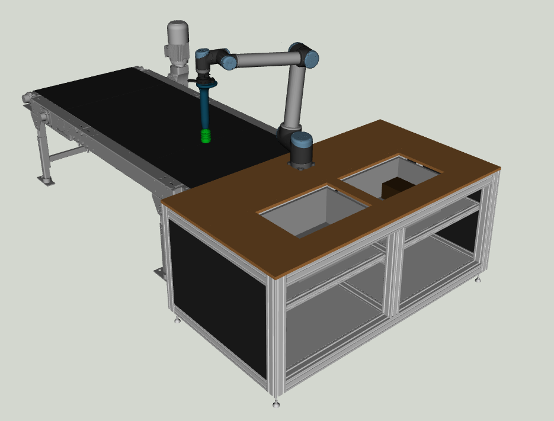
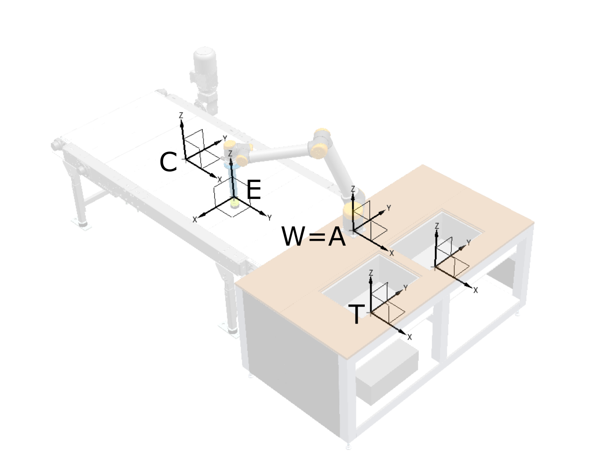

<div align="center">
<h1 align="center">
Finite State Machine in mc_rtc for Box demonstrator of I.AM. project
</h1>
</div>
<div align="center">
<h3>
<a href="https://research.tue.nl/en/persons/alexander-oliva">Alexander Oliva</a>,
<a href="/">Ricardo Duarte</a>,
<a href="/">Steven Eisinger</a>,
<a href="https://research.tue.nl/en/persons/maarten-jongeneel">Maarten Jongeneel</a>
<br>
<br>
Finate State Machine Controller
<br>
<br>
</h3>
</div>

Finate State Machine for the Box Demonstrator. This controller is made modular in a way that it can control any given sequence of states and corresponding IO's that are pre-specified in a single CSV file. The image below shows the scene in mc_rtc with the workbench, conveyor, robots, and totes.

<div align="center" id="figure1">
    <div style = "display: flex; align="left">
         
    </div>
    <p>Figure 1: Picture of the scene in mc_rtc.</p>
</div> 

Table of content
================
- [Installation](#installation)
  - [Dependencies](#dependencies)
  - [Installing the controller](#installing-the-controller)
- [Running the FSM controller](#running-the-fsm-controller)
  - [Running on real robot](#running-on-real-robot)
  - [Running in RVIZ only](#running-in-rviz-only)
  - [Running in Algoryx](#running-in-algoryx)
- [Configuration of the scene in mc_rtc](#configuration-of-the-scene-in-mc_rtc)
  - [Current robot objects and environment modules](#current-robot-objects-and-environment-modules)
  - [Adding objects/environments to mc_rtc](#adding-objectsenvironments-to-mc_rtc)
  - [States of the fsm controller](#states-of-the-fsm-controller)

## Installation
### Dependencies
Software programs/libraries:
- [ROS](http://wiki.ros.org/ROS/Installation)
- [mc_rtc](https://github.com/jrl-umi3218/mc_rtc)
- [mc_iam](https://gitlab.tue.nl/h2020-i-am-project/mc_iam) (_for I/O control on the robot setup in the Vanderlande innovation lab at the TU/e campus, make sure you clone the full_IO_control branch, see [here](https://gitlab.tue.nl/h2020-i-am-project/mc_iam/-/tree/feature/full_IO_control)_)

Packages for catkin workspace:
- [iam_description](https://gitlab.tue.nl/h2020-i-am-project/iam_description) (for this project we are using the "[ur10_FTSensor_sr_gripper.urdf](https://gitlab.tue.nl/h2020-i-am-project/iam_description/-/blob/main/urdfs/ur10_FTSensor_sr_gripper.urdf?ref_type=heads)" )
- [universal_robot package with (only) ur_description folder](https://github.com/ros-industrial/universal_robot)
- [mc_rtc_ros_control](https://github.com/mc-rtc/mc_rtc_ros_control)

Fur further details on installing these dependencies for the setup in the Innovation lab, please refer to [this guide](https://gitlab.tue.nl/h2020-i-am-project/i-am-hardware-software-integration-and-documentation/-/blob/main/UR10-mc_rtc-communication-guide.md).

Note that the catkin packages can directly be cloned in the ```src``` folder of your catkin workspace, and these packages can be build by running
```bash
cd catkin_ws
catkin_make
```

### Installing the controller

Make sure all dependencies listed above are installed and available on your PC. Then, follow the unstructions below.

1. To use the UR10 robot, copy the file called [ur10.yaml](/static/ur10.yaml), change the variables `<PATH TO CATKIN SRC>` to your catkin workspace, and place the file in any desired location on your system. In this file, under `minimalSelfCollisions` the distance between links that defines when a constraint must be activated, and the safety distance can be edited for each constraint, by editing `iDist` and `sDist` respectively.

2. Then, copy the [mc_rtc.yaml](/static/mc_rtc.yaml) file, change the variable `<PATH TO UR10 YAML>` to the path where you placed the [ur10.yaml](/static/ur10.yaml) on your system, and place the [mc_rtc.yaml](/static/mc_rtc.yaml) file in the `~/.config/mc_rtc/` folder of your system. This file is the main configuration of mc_rtc. As shown below, it decides the main robot, the controller that is run (under `Enabled`), the plugins used (in this case `UR_ROS` via `mc_iam` package) and the timestep. This ensures the communcation with the UR10 is via ROS control and we use the correct timestep of the UR10 (125Hz). 
    ```yaml 
    MainRobot: [json_iam, "<PATH TO UR10 YAML>/ur10.yaml"]
    Enabled: [FSMSequenceOne]
    Plugins: UR_ROS
    Timestep: 0.008
    ```

3. To install the controller and the robot including corresponding scene modules, simply build and install the cmake project:
    ```cmd
    mkdir build
    cd build
    cmake ../
    sudo make install
    ```

## Running the FSM controller 
### Running on real robot
1. Make sure that in the file [FSMSequenceOne.in.yaml](/etc/FSMSequenceOne.in.yaml), you define
    ```yaml
    real: 1
    ```
    This ensure the controller uses PC time to run the controller. If put to 0, it will use the simulation time.
2. In the file [FSMSequenceOne.in.yaml](/etc/FSMSequenceOne.in.yaml), make sure you have the correct lines commented such that you have:
    ```yaml
    #velocity: encoderFiniteDifferences  #Use this when not connected to robot
    velocity: encoderVelocities       #Use this when connected to robot
    ```
    This ensures you use the real robot encoder velocities.
3. This FSM controller will run states that are stored in the file [poses.csv](/src/states/BoxPoses/poses.csv). This file should is assumed to have the following structure:
    ```csv
    ee_pos_x | ee_pos_y | ee_pos_z | ee_rotvec_x | ee_rotvec_y | ee_rotvec_z | tolerance | IO_Vacuum | IO_Blowoff | IO_ConvCW | IO_ConvCCW | IO_Optitrack | IO_Reserved
    ```
    where each row of the CSV file defines a new state, and the IO's will be executed once the desired state is reached. 
    
    **NOTE**: Between states, we generate poses in a linear path to ensure the robot does move in a straight line between poses.

    **NOTE**: After each execution of IO_Vacuum or IO_Blowoff, we wait for 0.5 seconds (sleep(0.5)) to allow the system to pick-up or detach the object.

4. Next, open a new terminal. We start the connection with the UR10 via 
    ```cmd
    roslaunch ur_robot_driver ur10_bringup.launch robot_ip:=192.168.1.104 kinematics_config:=<PATH TO CALIBRATION FILE>/my_robot_calibration.yaml
    ```

5. In a new terminal, run the following command to start RViZ along with a mc_rtc dedicated panel, and the robot model:
    ```cmd
    cd <PATH TO THIS GIT>/scripts
    ./display.sh
    ```
6. Finally, in another terminal, run:
    ```cmd
    roslaunch mc_rtc_ros_control control.launch publish_to:=/joint_group_vel_controller/command subscribe_to:=/joint_states output_velocity:=true
    ```

### Running in RVIZ only
To run the controller without a connection to the UR10, follow the first step as above. Then, follow the steps below:
1. Make sure that in the file [FSMSequenceOne.in.yaml](/etc/FSMSequenceOne.in.yaml), you define
    ```yaml
    real: 0
    ```
    This ensure the controller uses simulation time to run the controller. 
2. In the file [FSMSequenceOne.in.yaml](/etc/FSMSequenceOne.in.yaml), make sure you have the correct lines commented such that you have:
    ```yaml
    velocity: encoderFiniteDifferences  #Use this when not connected to robot
    #velocity: encoderVelocities       #Use this when connected to robot
    ```
3. Open a terminal and run
    ```cmd
    roscore
    ```
4. Open another terminal, run the following command to start RViZ along with a mc_rtc dedicated panel, and the robot model:
    ```bash
    cd <PATH TO THIS GIT>/scripts
    ./display.sh
    ```
5. Open another terminal and run
    ```cmd
    rosrun mc_rtc_ticker mc_rtc_ticker
    ```
### Running in Algoryx
1. Make sure you have cloned the [GLUE](https://gitlab.tue.nl/h2020-i-am-project/glue-application) application (feature/UR10 branch, including `Projects/BoxDemonstrator` folder). NOTE: Would be nice to have this placed somewhere else in the future.
2. Make sure that in `PythonApplication/examples/agx.sh` you use in the line 
    ```sh 
    "$SCRIPT_DIR"/../run-AGX_URDF_Environment.sh skip-controller $@ --timeStep 0.008
    ```
    the correct timestep (for UR10, it is 1/125 = 0.008).
3. In the `~/.config/mc_rtc/mc_rtc.yaml`, make sure that `Plugins: UR_ROS` is disabled. 
4. Make sure that the name of the robot defined in your `PythonApplication/BoxDemonstrator/Scenes` folder has the same name as the robot name defined in the `etc/FSMSequenceOne.in.yaml` file of your `FSMSequenceOne` controller.
5. To be able to connect AGX with mc_rtc, we need to have a `ClickScene` defined. For us, this is defined as:
    ```yaml
    .format: 4

    # Use imports to avoid having two write the whole name of the component
    .import:
      Projects.BoxDemonstrator.Scenes: [BoxDemonstratorClick,ExternalJointBoxDemonstrator]

    ExternalJointBoxDemonstratorClick:
      .extends: BoxDemonstratorClick
      wantInternalPositioning: True

      scene:
        .value: ExternalJointBoxDemonstrator
        localTransform:
          position: Math.Vec3(0,0,0)

      clickobjects:
        - this.scene.ur10_FTSensor_sr_gripper
        - this.scene.box013
        - this.scene.box014
        - this.scene.box015
        - this.scene.box016
        - this.scene.box017
        - this.scene.box018
    ```
    where `ur10_FTSensor_sr_gripper` is the name of the robot (as defined in `BoxDemonstrator` scene file and the `etc/FSMSequenceOne.in.yaml` file of the controller).
6. Make sure that in the file [FSMSequenceOne.in.yaml](/etc/FSMSequenceOne.in.yaml), you define
    ```yaml
    real: 0
    ```
    This ensure the controller uses simulation time to run the controller. 
7. In the file [FSMSequenceOne.in.yaml](/etc/FSMSequenceOne.in.yaml), make sure you have the correct lines commented such that you have:
    ```yaml
    #velocity: encoderFiniteDifferences  #Use this when not connected to robot
    velocity: encoderVelocities       #Use this when connected to robot
    ```
    The robot in AGX is treated as a real robot, and also provides encoder velocities.
8. To start AGX, open a terminal and run:
    ```cmd
    sudo ../run-in-docker.sh examples/agx.sh models/Projects/BoxDemonstrator/Scenes/ExternalJointBoxDemonstratorClick.yml
    ```
    This calls for a click scene including the "External Joint", which is the implementation of the Suction Cup model in AGX. Then, open another terminal and run
    ```cmd
    mc_click
    ```
    to start the controller.
7. To stop the simulation in AGX, pres `esc`. (Pressing `Ctr+c` terminates the process in a wrong way, which makes you loose one of the AGX licences. After you lose 10, you have to wait 10 mins before you can run again.)
## Configuration of the scene in mc_rtc
This repository relies on several components that are made using mc_rtc.

### Current robot, objects, and environment modules
The repository contains several mc_rtc modules used to build the scene in mc_rtc. For more information regarding mc_rtc scene creation, please refer to the [mc_rtc tutorial](https://jrl-umi3218.github.io/mc_rtc/tutorials/advanced/new-robot.html) or the information in [this repository](https://gitlab.tue.nl/h2020-i-am-project/software-installation-scripts-and-tutorials/-/blob/master/Environment_creation_mc_rtc.md) on the TU/e gitlab. The modules that are included in this repository are given by:

- `workbench`: The workbench that is present in the Vanderlande innovation lab in Eindhoven.
- `conveyor002`: The conveyor that is present in the Vanderlande innovation lab in Eindhoven.
- `tote`: The tote as placed in the workbench
- `toss_box1-toss_box5`: The relevant boxes for the toss scenario, as described in the scenario specification document of the I.AM. project.

The configuration of these items in the scene is defined as shown in <a href="#figure2">Figure 2</a>. The origin of the world (as defined in mc_rtc), is at the base of the robot, as defined by frame **A**. We define all other poses as below.

<div align="center" id="figure2">
    <div style = "display: flex; align="left">
         
    </div>
    <p>Figure 2: Frame definition for the scene.</p>
</div> 

From conveyor to the robot base:
```math
^A\mathbf{H}_C =  \begin{bmatrix}1 & 0 & 0 &-1.76\\ 0 & 1 & 0 & -0.16\\ 0 & 0 & 1 & -0.105\\ 0 & 0 & 0 & 1\end{bmatrix}
```
From tote to the robot base:
```math
^A\mathbf{H}_T =  \begin{bmatrix}1 & 0 & 0 &0.505\\ 0 & 1 & 0 & -0.350\\ 0 & 0 & 1 & -0.282\\ 0 & 0 & 0 & 1\end{bmatrix}
```
From workbench to the robot base:
```math
^A\mathbf{H}_W =  \begin{bmatrix}1 & 0 & 0 &0\\ 0 & 1 & 0 & 0\\ 0 & 0 & 1 & 0\\ 0 & 0 & 0 & 1\end{bmatrix}
```
These poses are then defined in the [FSMSequenceOne.in.yaml](/etc/FSMSequenceOne.in.yaml) file.


### Adding objects/environments to mc_rtc
To add objects or environments to mc_rtc, follow these steps:
1. Make sure you have a `.urdf` and `.stl` (or `.dae`) file. The `.stl` or `.dae` file should be placed in the [/meshes/\<ENV_NAME>/](/meshes) directory of the controller, where `<ENV_NAME>` is the name of your environment (or object). Then, within the `.urdf` file, placed in the [/urdf/](/urdf/) folder of the controller, you need to point to your geometry file. For example, for the conveyor002, the urdf looks like:
    ```xml
    <?xml version="1.0" ?>
    <robot name="conveyor002">
      <link name="base_link" />

      <link name="conveyor002">
        <visual>
          <geometry>
            <mesh filename="file://@MESHES_DESTINATION@/conveyor002/conveyor002.stl" scale="0.001 0.001 0.001"/>
          </geometry>
          <material name="default">
            <color rgba="1.0 1.0 1.0 1" />
          </material>
        </visual>
        <collision>
          <origin xyz="0 0 0" rpy="0.0 0.0 0.0"/>
          <geometry>
            <box size="2 1.12 0.9"/>
          </geometry>
        </collision>
      </link>
      <joint name="conveyor002" type="fixed">
        <parent link="base_link" />
        <child link="conveyor002" />
        <origin rpy="1.570796251296997 0.0 -0.0" xyz="0 0 0" />
      </joint>
    </robot>
    ``` 
    where the `filename` variable points to the `.stl` file. 
  2. You need to add in the [/aliases](/aliases/) folder a yaml file with the name `<ENV_NAME>.in.yaml`, where `<ENV_NAME>` is the name of your environment/object. This file should contain the line
      ```yaml
      env/<ENV_NAME>: [env, "@SHARE_DESTINATION@", <ENV_NAME>]
      ```
      in case of an environment, and should be
      ```yaml
      env/<ENV_NAME>: [object, "@SHARE_DESTINATION@", <ENV_NAME>]
      ```
      in case of an object.
  3. You need to add your environment/object into the [/etc/<CONTROLLER_NAME>.in.yaml](/etc/FSMSequenceOne.in.yaml) file as a robot. Under `robots`, you can add the environment/object via:
      ```yaml
      robots:
        <ENV_NAME>:
          module: env/<ENV_NAME>
          init_pos:
            translation: [0,0,0] #Initial position
            rotation: [0,0,0]    #Initial orientation
      ```
      where the position and orientation of the environment/object is w.r.t. the origin of mc_rtc (defined by the `init_pos` field in that same file). 
  4. Next, you need to make sure the newly added environment/object is included into the building of your controller. To do so, we add in the [CMakeList.txt](/CMakeLists.txt) the following lines of code:
      ```cmake
      set(URDF_<ENV_NAME> "${CMAKE_CURRENT_BINARY_DIR}/urdf/<ENV_NAME>.urdf")
      configure_file(urdf/<ENV_NAME>.urdf "${URDF_<ENV_NAME>}" @ONLY)
      install(FILES "${URDF_<ENV_NAME>}" DESTINATION "${URDF_DESTINATION}")
      install_aliase(<ENV_NAME>)
      ```
      where, again, `<ENV_NAME>` should be replaced with the name of your environment/object.
  5. To make sure you also add the newly added environment/object to RVIZ, we need to include it into the [/scripts/etc/display.rviz](/scripts/etc/display.rviz) file. To do so, we add the following item in the list of `Displays`:
      ```yaml
      - Alpha: 1
          Class: rviz/RobotModel
          Collision Enabled: false
          Enabled: true
          Links:
            All Links Enabled: true
            Expand Joint Details: false
            Expand Link Details: false
            Expand Tree: false
            Link Tree Style: Links in Alphabetic Order
            base_link:
              Alpha: 1
              Show Axes: false
              Show Trail: false
            <ENV_NAME>:
              Alpha: 1
              Show Axes: false
              Show Trail: false
              Value: true
          Name: <ENV_NAME>
          Robot Description: control/env_4/robot_description
          TF Prefix: control/env_4
          Update Interval: 0
          Value: true
          Visual Enabled: true
      ```
      It is important here to update `env_4` based on the amount of environments that are already placed under the `Displays` list. 
  6. In order to build and install the new changes, run in a terminal:
      ```cmd
      cd <PATH_TO_BUILD_FOLDER>
      cmake .. && sudo make install
      ```

### States of the FSM controller
The controller is a basic FSM (finite state machine) controller in mc_rtc, which consists of several states with various functionalities:

- **FSMSequenceOne_Initial**: controls the initialization of the controller, moves robot to predetermined initial posture.
- **Operation**: moves the UR10 robot throught all the states as defined in [poses.csv](/src/states/BoxPoses/poses.csv). It also controls the IO's to what is specified there, according to the tolerance specified there. 

The configuration of the FSM is defined in [etc/FSMSequenceOne.in.yaml](etc/FSMSequenceOne.in.yaml).
